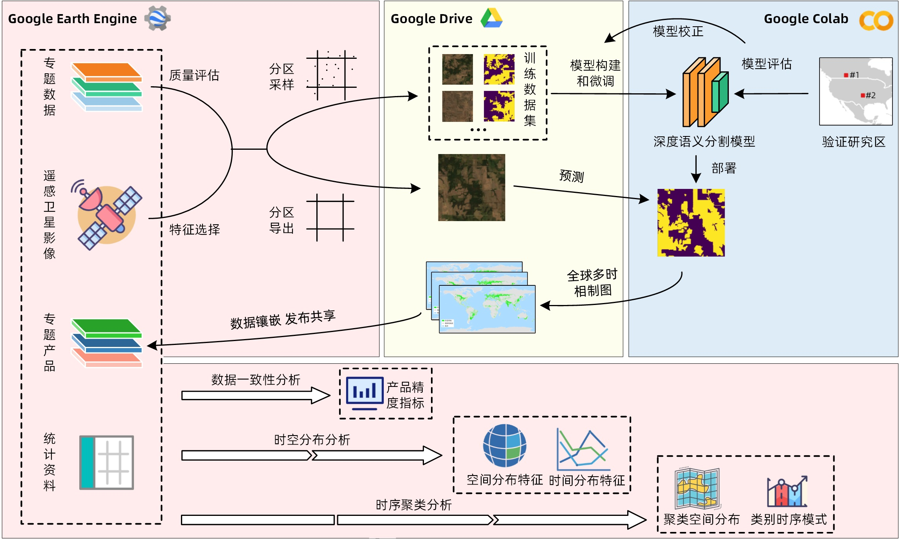

# Introduction

This repository contains Global Multi-temporal Cropland Mapping developed by [Penghua Liu](https://liuph0119.github.io/about/).

The pixel-wise cropland extraction is implemented by deep semantic segmentation networks and the pre-trained (or fine-tuned) model is deployed to the [Google Drive](https://drive.google.com/). Afterwards, we request GPU computational resources in [Google Colab (Colab)](https://colab.research.google.com/) and create sessions for inference from satellite images using the deployed model. By the way, the satellite images were exported from [Google Earth Engine (GEE)](https://earthengine.google.com/).

The overall workflow is presented in the following figure.



# How to use

As shown in the above figure, there are 4 steps for global cropland mapping, including **training data preparation**, **model training and calibration**, **model deployment and inference**, and **evaluation**.

## 1. Training data preparation

It is well known that training datasets for semantic sementation are patch of images and pixel-wise dense labeled images. That is, for an input image with a shape of $H \times W \times C$, the model output is a label image with a shape of $H \times W \times 1$. I have provided a semantic segmentation suit implemented with Keras [here](https://github.com/liuph0119/Semantic_Segmentation_Keras).

### 1.1 Export training samples

To export training samples from GEE, you can run my shared script in GEE [here](https://code.earthengine.google.com/67b773408a1455f74ca7a9e7c46a858a?noload=true), or you can copy the codes in `S1-1 ExportTrainingSamples.js` and run it in the GEE code editor.

> **Note**: The exported samples are formatted in '\*.tfrecord' to save storage. Each TFRecord file contains all the collected sample points in each grid (TFRecord files are memory-limited, so you can't store too much data). To take as many samples as possible, the size of the grid can be reduced.

Tensorflow simplifies the data loading process by building sequences of TFRecord files. However, it is very inefficient for each batch to extract samples from the tfrecord sequence. So, we have to extract samples from grids and convert tfrecords to '\*.h5' files.

### 1.2 Data pre-process

You can dwownload the tfrecord samples to your local machine and convert them to '\*.h5' files.

`S1-2 Preprocess.ipynb` provides a interactive notebook to download tfrecord files from Google Cloud Storage (GCS) (only if you export samples to GCS) and convert them to H5s. A data description table can be ontained by running the `Statistic the feature properties to a table` cell.

You have to modify the settings to fit your tasks.

> **Note**: Converting TFRecords to H5s and calculate feature properties also take some time.

Basides, the privided notebook provides some functions for data exploratory analysis. You can view the distribution of feature bands and labels and their co-relations.

## 2. Model training and calibration

Model training and calibration is the core task.

### 2.1 Oversample positive samples

Before training, you have to split the training set and validation set. Treating the positive and negative classes equally, we find that the proportional distribution of positive and negative classes in each sample is extremely uneven. Thus, we have to oversample the positive samples.

Specifically, we recalss each label image with a class according to the proportion of positive pixels. For example, if a label image has a positive class pixel ratio of 0.23, we recalss this label image to 2. Criteria for reclassification can be fomulated as $c = \lfloor (rp + 0.05) \times 10 \rfloor$

After reclassification, we oversample samples in the low frequency category and create texts that record train/val filenames.

The above steps can be achieved by simply running the `Split Train/Val Dataset` cell in `S1-2 Preprocess.ipynb`.

### 2.2 Model Training

You only have to modify the `cfgs.py` file and then run the `S2-2 TrainSegModel.py` file.

## 3. Model deployment and inference

### 3.1 Model Deployment

Upload the generated best model weights to you Google Drive and store it in folder `ckpt`. The model architecture json file `pspnet_192x192x7.json` should also be uploaded to `ckpt` folder.

I have share two checkpoints and the model configuration json file:

- model checkpoint \*.h5 files
  - [bcegdice_pspnet50_2015lc08srsmote_c1_192x192x7.h5](https://drive.google.com/open?id=17g0IlqDd7hvUPOIkTPYUW-lKg8x_LCAT)
  - [bcegdice_pspnet50_2010lt05srsmote_c1_192x192x7.h5](https://drive.google.com/open?id=1YgYuEh6Wq785mIrYK3bZPiJ299M2b1Fm)
- model configuration \*.json file: [pspnet_192x192x7.json](https://drive.google.com/open?id=1Dfz03vYgwlLoV71NAgvGvgt2sFHdeLFh)

### 3.2 Set up automatic Google Drive trash removal

Since we are constantly importing images to Google Drive, we need to clean up the processed images in a timely manner to facilitate storage of other images.

More details about how to set up automatic google drive trash removal can be found [here](https://www.amixa.com/blog/2019/04/05/automatically-empty-google-drive-trash/). We set the time interval to `everyMinutes(15)`。

### 3.3 Run model

Get the colab link [here](https://colab.research.google.com/drive/1WlFX7qMHmX3WbkjTNOrLIYq1JKB2jgKF)

For your custom tasks, you can change `year`, `all_grids`, `all_grid_ids` in the **Parameter Setting** section.

```python
year = 2012
all_grids = ee.FeatureCollection('users/liuph/shape/WorldGrid2p5dSimplev2')
ALL_GRID_IDS = all_grids.reduceColumns(ee.Reducer.toList(), ['ID']).getInfo().get('list')
ALL_GRID_IDS.sort()

# # # define I/O folders
RAW_IMAGE_DIR = '/content/drive/My Drive/raw_images'
PREDS_DST_DIR = '/content/drive/My Drive/%d_preds' % year
os.makedirs(PREDS_DST_DIR, exist_ok=True)

# # # define model parameters
MODEL_VERSION = 'bcegdice_pspnet50_2015lc08srsmote_c1_192x192x7' if year >= 2012 else 'bcegdice_pspnet50_2010lt05srsmote_c1_192x192x7'
MODEL_CONFIG_PATH = '/content/drive/My Drive/ckpt/pspnet_192x192x7.json'
MODEL_CKPT_PATH = '/content/drive/My Drive/ckpt/%s.h5' % MODEL_VERSION
MODEL_INPUT_SHAPE = (192, 192, 7)
PREDICT_STRIDE = 72
CHANNEL_MINS = np.array([0, 0, 0, 0, 0, -1, -400])
CHANNEL_MAXS = np.array([1, 1, 1, 1, 1, 1, 2000])

all_grid_ids = ALL_GRID_IDS[0:300]
```

### 3.4 Upload to GEE

You can upload your results to GEE ans share with others.

The first thing you have to do is to upload your results to GCS, and then run [this script](https://colab.research.google.com/drive/1VM3pjMt-aEeTI5RlWllFd8zZJHgameSs?usp=sharing) to upload to GEE.

## 4. Evaluation

Overlay your own verification points with the product for accuracy verification.
